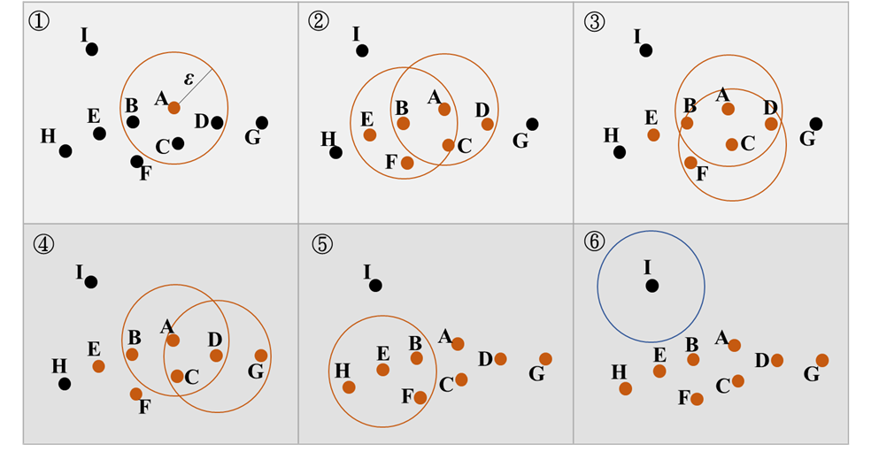

<style type="text/css">

body{
font-size: 18px;
font-family:"Times New Roman","標楷體",Georgia,Serif;
}
td {  /* Table  */
  font-size: 8px;
  font-family:"Times New Roman","標楷體",Georgia,Serif;
}
h1.title {
  font-size: 38px;
  color: DarkRed;
  font-family:"Times New Roman","標楷體",Georgia,Serif;
}
h1 { /* Header 1 */
  font-size: 28px;
      font-family:"Times New Roman","標楷體",Georgia,Serif;
  color: DarkBlue;
}
h2 { /* Header 2 */
    font-size: 22px;
    font-family:"Times New Roman","標楷體",Georgia,Serif;
    color: DarkBlue;
}
h3 { /* Header 3 */
  font-size: 18px;
  font-family:"Times New Roman","標楷體",Georgia,Serif;
  color: DarkBlue;
}
code.r{ /* Code block */
    font-size: 12px;
}
pre { /* Code block - determines code spacing between lines */
    font-size: 14px;
}
.blogbody{
font-size:17px;
  font-family:"Times New Roman","標楷體",Georgia,Serif;
line-height: 150%;
}
</style>


```{r setup, include=FALSE}
knitr::opts_chunk$set(echo = TRUE)
library(dplyr)
library(ggplot2)
library(dbscan)
library(knitr)
library(kableExtra)
```

## R 下載 DBSCAN 套件
在R裡面有許多套件支援 DBSCAN 的分群，其中一個最常見的就是`dbscan`，必須先安裝並導入。  

```{r install, echo=T, eval=F}
install.packages("dbscan")
library(dbscan)
```

## 程式碼撰寫

以下是你的程式碼：
```{r code_variable, echo=T, eval=T}
data=read.csv("./變數.csv", sep=",", header=T)

data[(data=="" | data==" " | data=="  ")]=NA

data$public=ifelse(is.na(data$public), 1, data$public)
data$private=ifelse(is.na(data$private), 0, data$private)
data$PPP=ifelse(is.na(data$PPP), 0, data$PPP)

data$urban=ifelse(is.na(data$urban), 0, data$urban)
data$urban.or.rural=ifelse(is.na(data$urban.or.rural), 1, data$urban.or.rural)
data$rural=ifelse(is.na(data$rural), 0, data$rural)
```

上面 data 的資料格式是 dataframe，不過在 `dbscan()` 的輸入資料必須是 matrix，因此我們必須先把 data 轉換為 matrix 的形式。注意第一個欄位是 DRTS 路線的名稱，並非 dbscan 可處理的欄位，必須先剔除之。
```{r transform, echo=T, eval=T}
data_mat=as.matrix(data[, 2:18])
```

dbscan 演算法的分群方法說明如下。DBSCAN (Density-based spatial clustering of applications with noise)演算法是以密度為基礎，利用資料分布的密集度將密度高的區域形成數個群集，而相對密度低者或零散資料點則視為雜訊或偏離值。DBSCAN 必須設定兩參數，一是鄰近區域的半徑（Eps），為每次探訪資料點的半徑，半徑愈大，分群的數目可能愈少；另一參數則為鄰近區域的最小點數（MinPts），若半徑（Eps）內之資料點數大於最小點數（MinPts），則將所有點資料劃分至同一群集中，若小於最小點數（MinPts）則將該資料群視為雜訊。根據上述參數的設定即可重複執行迭代演算，直至當前所有點無法再分類至該群集中。接著再自一個未曾訪問的資料點中選取其一資料，重複上述步驟完成所有資料點的聚類，直至所有資料點皆訪問完畢。  

DBSCAN 演算程序整理如下圖所示。圖中假設半徑（Eps）為 ε，最小點數（MinPts）為 4，亦即每一次尋找群集時，需檢查半徑內是否有 4 個點，若有
則將所有點劃分至同一群集中。步驟①乃以 A 點為中心， ε 為半徑，將 A、 B、C、 D 四點劃分於同一範圍內，故四點歸類於同一群集。接著步驟②再以 B 點為中心， ε 為半徑，將 A、 B、 C、 E、 F五點劃分於同一範圍中，故亦歸類於同一群集中。以次類推，及至所有圖中的點劃分完畢後，剩餘無法歸類在任何一群集中的點即為噪點（noise），如圖中的 I 點。

```{r dbscan_ref, echo=F, out.width="80%", fig.align="center"}

```


dbscan 函式中須設定最大搜尋半徑和最小分群數目，在 data 這個資料中，eps 就是指所有變數的幾何距離（Euclidean Distance），譬如(0,1,1)和(1,0,1)兩個樣本的距離就會是√2。在 data 這組資料中，因為所有的變數都是0或1，所以最大距離其實就是一組「全為0的資料」，和一組「全為1的資料」兩者間的距離，也就是17√2（我們總共有17個變數~）。如果我們 eps 半徑設定的越大，就會使所有 DRTS 路線被我們分類到同一個類群中，這樣其實不是合理的分類結果；但半徑設太小，反而會產生非常多噪點，也不是我們預期的結果。 MinPts 表示每一個類群中最少的 DRTS 路線數。以下我們先來做隨機試驗：  

假設搜尋半徑設定為1，類群最少路線數是2條
```{r dbscan_test, echo=T, eval=T}
db = dbscan(data_mat, eps=1, minPts=2)
db$cluster
```

程式碼中`db$cluster`表示每一條路線所分到的類組，如果數字是0，表示該條路線為噪點，無法分類在任何一群中。接著可以把這組向量和原本我們的 data 資料合併，就可以更明確了解各路線的分群（如表格最後一欄位所示）。  

```{r dbscan_result_1, echo=T, eval=F}
cbind(data, cluster=db$cluster)
```

```{r dbscan_result_2, echo=F, eval=T}
kbl(cbind(data, cluster=db$cluster), booktabs=T)%>%
  kable_styling(bootstrap_options=c("striped", "hover"), font_size=14)%>%
  column_spec(1, bold=T)%>%
  column_spec(19, bold=T, color="red")%>%
  scroll_box(width = "100%", height = "200px")
```

但是這裡就會衍生一個問題，我們根本不知道如何界定這兩個參數，所以可以嘗試使用 for 迴圈，將 dbscan 進行多次試驗，尋找最合適的分組方法。如果我們的目標是希望噪點最少，也就是得到的分群結果中數字0會是最少的，但同時也希望能分出合理的群組數。此時可以用以下方法去做多次測試。

```{r dbscan_for, echo=T, eval=T}
test=data.frame()
for (i in seq(0.1, 2, 0.1)){
  for (j in c(2:5)){
    # 執行 dbscan 分群
    db = dbscan(data_mat, eps=i, minPts=j)
    
    # 利用 temp 儲存 dbscan 的結果
    temp=cbind(data, cluster=db$cluster)
    
    # 計算噪點個數
    noise_num=nrow(temp[temp$cluster==0,])
    
    # 計算分群數
    cluster_num=length(unique(temp$cluster[temp$cluster!=0]))
    
    # 把上面的分群結果和噪點個數、分群數全部記錄起來
    test=rbind(test, data.frame(eps=i, minPts=j, noise_num=noise_num, cluster_num=cluster_num))
  }
}
```

試驗結果如下：
```{r dbscan_result_3, echo=F, eval=T}
kbl(arrange(test, noise_num), booktabs=T)%>%
  kable_styling(bootstrap_options=c("striped", "hover"), font_size=14)%>%
  column_spec(1, bold=T)%>%
  scroll_box(width = "50%", height = "200px")
```


```{r dbscan_result_figure, echo=F, eval=T}
ggplot(test)+
  geom_tile(aes(x=eps, y=minPts, fill=noise_num), color="#000000")+
  scale_fill_continuous(low="#FFECEC", high="#CE0000", name="# of noise")+
  theme_minimal()
```

從表格和圖形，我們可以發現若將半徑設定為 2，且最小路線數設定為 2，此時噪點數會是最少的，達成我們最小化噪點數的目的。但事實上觀察表格可以發現，在此情境下只分類程一群，表示所有 DRTS 路線都是在同一個分群中，並不是我們所預期的結果。或許可以挑半徑設定為 1.5，且最小路線數設定為 2 之情境，此時可以分成 7 條路線，且只有 7 個噪點。

最後再來看看我們「半徑設定為 1.5，最小路線數設定為 2」 的分類結果!!
```{r dbscan_final, echo=F, eval=T}
db = dbscan(data_mat, eps=1.5, minPts=2)
kbl(cbind(data, cluster=db$cluster), booktabs=T)%>%
  kable_styling(bootstrap_options=c("striped", "hover"), font_size=14)%>%
  column_spec(1, bold=T)%>%
  column_spec(19, bold=T, color="red")%>%
  scroll_box(width = "100%", height = "200px")
```

以上只是目前我想到的方法，或許還有更好的設定參數方法，可以思考看看!!  


