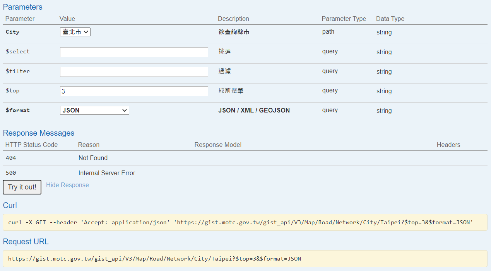

<style type="text/css">

body{
font-size: 18px;
font-family:"Times New Roman","標楷體",Georgia,Serif;
}
td {  /* Table  */
  font-size: 8px;
  font-family:"Times New Roman","標楷體",Georgia,Serif;
}
h1.title {
  font-size: 38px;
  color: DarkRed;
  font-family:"Times New Roman","標楷體",Georgia,Serif;
}
h1 { /* Header 1 */
  font-size: 28px;
      font-family:"Times New Roman","標楷體",Georgia,Serif;
  color: DarkBlue;
}
h2 { /* Header 2 */
    font-size: 22px;
    font-family:"Times New Roman","標楷體",Georgia,Serif;
    color: DarkBlue;
}
h3 { /* Header 3 */
  font-size: 18px;
  font-family:"Times New Roman","標楷體",Georgia,Serif;
  color: DarkBlue;
}
code.r{ /* Code block */
    font-size: 12px;
}
pre { /* Code block - determines code spacing between lines */
    font-size: 14px;
}
.blogbody{
font-size:17px;
  font-family:"Times New Roman","標楷體",Georgia,Serif;
line-height: 150%;
}
</style>


```{r setup, include=FALSE}
knitr::opts_chunk$set(echo = TRUE)
library(dplyr)
library(ggplot2)
library(jsonlite)
library(sf)
library(knitr)
```

## R 下載相關套件
由於我們介接API所下載的格式是JSON檔，因此必須利用`jsonlite`套件解析該格式。在下載完資料後，檔案僅是以文字存取，但為進一步作地理資訊分析，我們必須轉換為地理資訊格式（如.shp），而`sf`套件即是用來做地理分析的工具。另外做大數據分析和繪圖可分別下載`dplyr`與`ggplot2`套件。

```{r install, echo=T, eval=F}
install.packages("jsonlite")
install.packages("sf")
install.packages("dplyr")
install.packages("ggplot2")
library(jsonlite)
library(sf)
library(dplyr)
library(ggplot2)
```

## 介接路網API

以下是介接交通部GIS-T路網資料的程式碼，我們以台北市道路路網為例，詳細步驟依序為：  

1. 在[swaggerMOTC](https://gist.motc.gov.tw/gist_api/swagger/ui/index#!/PhysicalNetwork/PhysicalNetwork_03002)這個網頁中，移動到實體路網（PhysicalNetwork）中的"取得指定縣市之道路路網圖資資料"。  
2. 點選City參數為"臺北市"，`$top`參數為3（意指挑選資料庫前3筆資料），`$format`參數為JSON，設定完成後點選`Try it out!`，隨後網頁會回傳Request URL。  
3. 將Request URL的網址複製起來。  

```{r API figure, echo=F, out.width="80%", fig.align="center"}

```

完成複製後，我們必須將Request URL的網址稍作修正，剛剛我們只回傳了前3筆資料，所以網址中有`$top=3`這個參數，但事實上我們希望能回傳所有資料，因此須把這個參數予以刪除，即：
`https://gist.motc.gov.tw/gist_api/V3/Map/Road/Network/City/Taipei?$top=3&$format=JSON`  
應更正為：  
`https://gist.motc.gov.tw/gist_api/V3/Map/Road/Network/City/Taipei?&$format=JSON`  

(之所以要這樣修正，是因為如果我們一開始沒有設定`$top`這個參數，會使我們的網頁回傳時間過久，網頁甚至會當掉!)

修正完畢，我們就可以用`jsonlite`套件內的`fromJSON`來讀取這個檔案了!!

```{r code_read_json, echo=T, eval=T}
road=fromJSON("https://gist.motc.gov.tw/gist_api/V3/Map/Road/Network/City/Taipei?&$format=JSON")
```

不過讀取完後的資料只是文字檔，因此必須再利用`sf`套件轉換成地理資訊格式。觀察road資料裡面可發現，其中有一個欄位是Geometry，它是利用[WKT](https://www.wikiwand.com/en/Well-known_text_representation_of_geometry)格式記錄地理資訊，我們可以利用`st_as_sfc`這個函式來轉換。此外整個road資料也必須設定為地理資訊格式，須利用`st_sf`轉換，其中應設定`crs`為`4326`，亦即WGS84經緯度系統。

```{r road_sf, echo=T, eval=T}
road=mutate(road, Geometry=st_as_sfc(Geometry))%>%
  st_sf(crs=4326)
```

最後我們再來畫張地圖，以確認路網是否完整匯入。

```{r road_plot, echo=T, eval=F}
ggplot(road)+
  geom_sf()
```

```{r road_plot_r, echo=F, eval=T, fig.width=4, fig.height=4, dpi=120, fig.align="center"}
windowsFonts(A=windowsFont("標楷體"))
ggplot(road)+
  geom_sf(aes(color=RoadClassName))+
  scale_color_manual(values=c("省道一般道路"="#0072E3", "國道"="#00EC00"),
                     name="公路類型")+
  theme(panel.background=element_blank(),
        legend.title=element_text(size=15, family="A"),
        legend.text=element_text(size=12, family="A"),
        legend.key=element_blank(),
        axis.title=element_blank(),
        axis.text=element_blank(),
        axis.ticks=element_blank())
```


另外交通部亦建構交通資訊基礎路段編碼查詢API平臺，可供使用者輸入道路編碼，並設定


