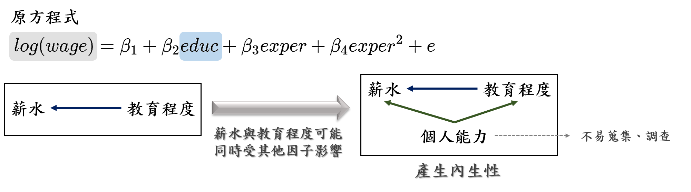
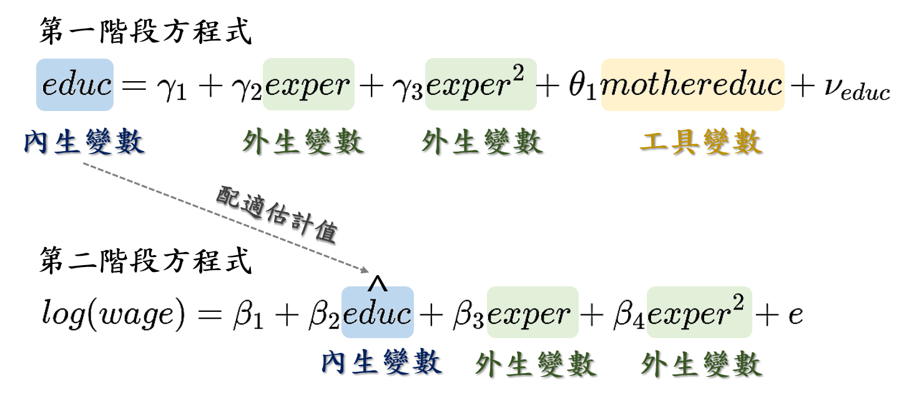
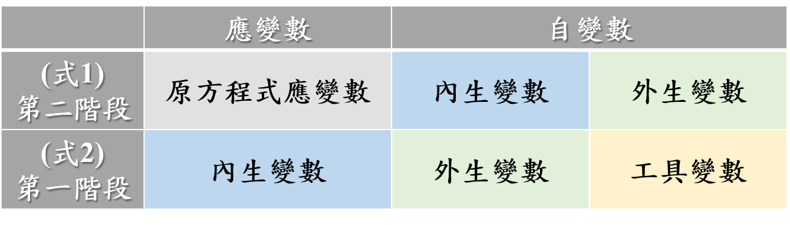
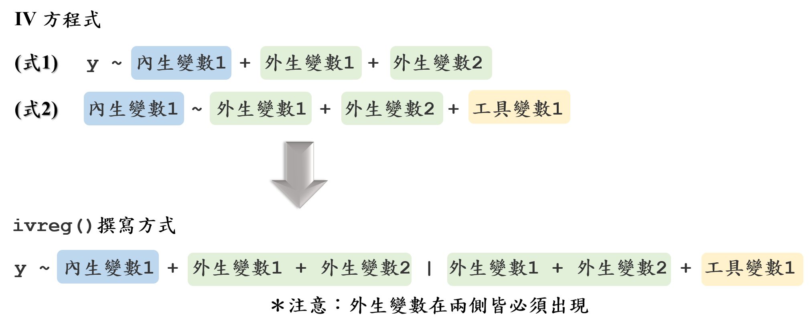
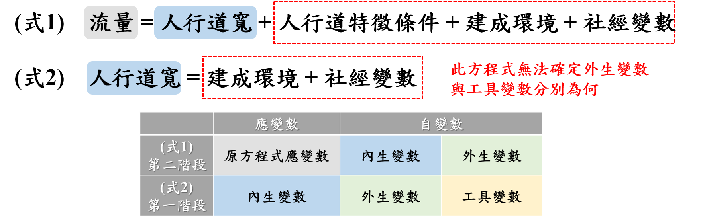
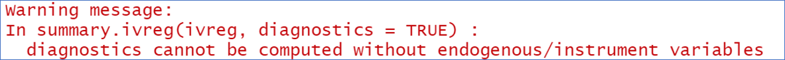
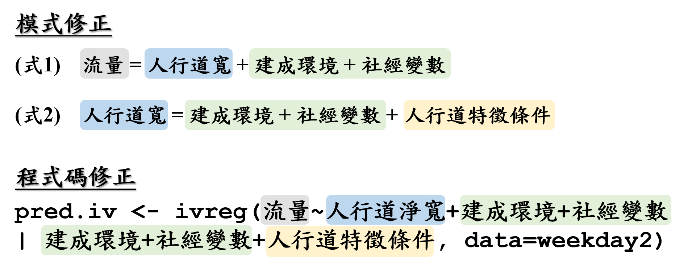

<style type="text/css">

body{
font-size: 18px;
font-family:"Times New Roman","標楷體",Georgia,Serif;
}
td {  /* Table  */
  font-size: 8px;
  font-family:"Times New Roman","標楷體",Georgia,Serif;
}
h1.title {
  font-size: 38px;
  color: DarkRed;
  font-family:"Times New Roman","標楷體",Georgia,Serif;
}
h1 { /* Header 1 */
  font-size: 28px;
      font-family:"Times New Roman","標楷體",Georgia,Serif;
  color: DarkBlue;
}
h2 { /* Header 2 */
    font-size: 22px;
    font-family:"Times New Roman","標楷體",Georgia,Serif;
    color: DarkBlue;
}
h3 { /* Header 3 */
  font-size: 18px;
  font-family:"Times New Roman","標楷體",Georgia,Serif;
  color: DarkBlue;
}
code.r{ /* Code block */
    font-size: 12px;
}
pre { /* Code block - determines code spacing between lines */
    font-size: 14px;
}
.blogbody{
font-size:17px;
  font-family:"Times New Roman","標楷體",Georgia,Serif;
line-height: 150%;
}
</style>


```{r setup, include=FALSE}
knitr::opts_chunk$set(echo = TRUE)
library(knitr)
library(AER)
library(PoEdata)
data("mroz", package="PoEdata")
```

## **內生性與工具變數**
在原始方程式中，若應變數與自變數同時受其他變因的影響，此時即產生內生性的問題，必須加以修正。以薪水與教育程度為例，一般認為教育程度會影響薪水，因此在建立模式時，會將薪水作為應變數，教育程度作為自變數。然而事實上「個人能力」可能同時會影響薪水與教育程度，此時就會產生內生性的問題，此外「個人能力」此一變數又難以蒐集或調查，故將引介「工具變數」來修正。在此一範例中「教育程度」即為內生變數，而為了避免內生性的產生，必須尋找一工具變數來代替內生變數，使其與「教育程度」高度相關，並與原始應變數（薪水）低度或無相關。  

```{r wage_edcuation_example, echo=FALSE, out.width="90%", fig.align="center"}

```

引入工具變數後，可利用兩階段最小平方法（TSLS）校估模型，而模型則可拆分為兩式。第一階段中將內生變數作為應變量，而外生變數與工具變數作為自變量，此一階段中我們預期工具變數將會是顯著的變量，如此一來尚能利用此工具變數來代替內生變數。接著第二階段中的應變量即原始方程式中的應變量，而自變量則包含內生變數與外生變數，惟須注意的是在此的內生變數係在第一階段中所校估之應變量配適值（y hat）。  

```{r wage_edcuation_example_revised, echo=FALSE, out.width="70%", fig.align="center"}

```

根據上述方程式之建構，可以把第一階段與第二階段方程式的應變數與自變數整理如下：  

```{r model_table, echo=FALSE, out.width="60%", fig.align="center"}

```

這裡必須特別注意，無論是第一階段或第二階段的方程式，皆須出現「外生變數」！


## **`ivreg()`函式**
在R語言中可利用`AER`套件中的`ivreg()`函式建構此模型，其撰寫方式彙整如下：  

```{r ivreg_model, echo=FALSE, out.width="85%", fig.align="center"}

```

同樣地，在`ivreg()`函式中，「`|`」兩側都必須出現外生變數。  

在此以上述的範例撰寫程式碼，我們預期年資（exper）和教育程度（educ）會影響薪資（wage），但教育程度和薪資可能同時受「其他蒐集不到的變量」之影響，進而產生內生性的問題，此時需要引介一個工具變數來加以修正。以下模型中乃利用母親的教育程度（mothereduc）作為工具變數，程式碼撰寫如下。  

```{r wage_model_R1, echo=F, eval=T, fig.align="center"}
wage=mroz1=mroz[mroz$lfp==1,] 
```

```{r wage_model_R2, echo=T, eval=T, fig.align="center"}
wage.iv=ivreg(log(wage) ~ educ+exper+I(exper^2) | exper+I(exper^2)+mothereduc, data=wage)

summary(wage.iv)
```


## **人行道模型**
根據上述模型建構方式，檢視以下的人行道流量模型：  

```{r pedestrian_model, echo=FALSE, out.width="70%", fig.align="center"}

```

此一方程組中，流量為原始模型的應變數，人行道寬為內生變數，但此時無法確定外生變數與工具變數分別為何。這也是導致在`ivreg()`函式還傳結果中出現以下警告訊息的主要原因。  

```{r warning_message, echo=FALSE, out.width="70%", fig.align="center"}

```

建議或許可以將模式修正如下，惟模式僅供參考，尚須專業背景知識尚能釐清。程式碼撰寫修正亦羅列如下。  

```{r model_revised, echo=FALSE, out.width="70%", fig.align="center"}

```

此一模式中假定人行道寬為內生變數，並且新增一工具變數「人行道特徵條件」修正內生性問題，而外生變數則包含建成環境與社經變數。如此建構應該可以解決以上錯誤訊息，但應該不是很合理QQ。  

  
  
## **參考資料**
[PoE with R - Chapter 10 Random Regressors](https://bookdown.org/ccolonescu/RPoE4/random-regressors.html)  
[Introduction to Econometrics with R - Chapter 12.2 The General IV Regression Model](https://www.econometrics-with-r.org/12-2-TGIVRM.html)

