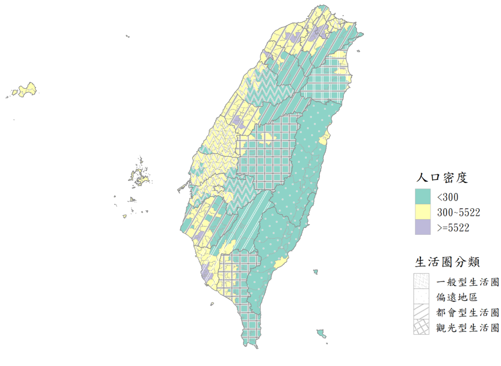

<style type="text/css">

body{
font-size: 18px;
font-family:"Times New Roman","標楷體",Georgia,Serif;
}
td {  /* Table  */
  font-size: 8px;
  font-family:"Times New Roman","標楷體",Georgia,Serif;
}
h1.title {
  font-size: 38px;
  color: DarkRed;
  font-family:"Times New Roman","標楷體",Georgia,Serif;
}
h1 { /* Header 1 */
  font-size: 28px;
      font-family:"Times New Roman","標楷體",Georgia,Serif;
  color: DarkBlue;
}
h2 { /* Header 2 */
    font-size: 22px;
    font-family:"Times New Roman","標楷體",Georgia,Serif;
    color: DarkBlue;
}
h3 { /* Header 3 */
  font-size: 18px;
  font-family:"Times New Roman","標楷體",Georgia,Serif;
  color: DarkBlue;
}
code.r{ /* Code block */
    font-size: 12px;
}
pre { /* Code block - determines code spacing between lines */
    font-size: 14px;
}
.blogbody{
font-size:17px;
  font-family:"Times New Roman","標楷體",Georgia,Serif;
line-height: 150%;
}
</style>


```{r setup, include=FALSE}
knitr::opts_chunk$set(echo = TRUE)
library(dplyr)
library(tidyr)
library(knitr)
library(sf)
library(ggplot2)
library(tmap)
library(TWspdata)
library(tmap)
library(jsonlite)
library(classInt)
library(ggsflabel)
library(ggpattern)
library(gt)
library(segmented)

windowsFonts(A=windowsFont("標楷體"))
windowsFonts(B=windowsFont("Times NEw Roman"))
```

## **生活圈分類**

臺灣所有鄉鎮市區分類依據鼎漢所提供的「市區道路評估指標項目」文件，可分為都會型生活圈、一般型生活圈、觀光型生活圈、偏遠地區等四類。為細部給予各區域評估之權重，進一步依據「人口密度細分」，分類結果如下圖與表格所示。  

```{r pop_dens, echo=F, eval=T, out.width="100%", warning=F, message=F}
pop_dens=fromJSON("https://od.moi.gov.tw/api/v1/rest/datastore/301000000A-000605-067")
pop_dens=pop_dens$result$records
pop_dens=pop_dens[-1,]
pop_dens=filter(pop_dens, !(people_total %in% c("…", "")))
pop_dens$COUNTYNAME=substr(pop_dens$site_id, 1, 3)
pop_dens$TOWNNAME=substr(pop_dens$site_id, 4, 10)
pop_dens$people_total=as.numeric(pop_dens$people_total)
pop_dens$area=as.numeric(pop_dens$area)
pop_dens$population_density=as.numeric(pop_dens$population_density)

pop_dens=left_join(taiwan_town[,c(2:4)], pop_dens[,c(3:7)])%>%
  st_transform(crs=4326)


# piecewise regression
pop_dens=arrange(pop_dens, population_density)
pop_dens=cbind(percentile=c(1:nrow(pop_dens))*100/nrow(pop_dens), pop_dens)
sww_reg=lm(population_density ~ percentile, data=pop_dens)

sww_reg_piecewise=segmented(sww_reg, seg.Z=~percentile, psi=90)
sww_psi=pop_dens$population_density[which.min(pop_dens$percentile<sww_reg_piecewise$psi[2])]


temp=mutate(pop_dens, pop_class=case_when(
  population_density<300 ~ "<300",
  population_density<sww_psi ~ paste0("300~", sww_psi),
  TRUE ~ paste0(">=", sww_psi)
))
temp$pop_class=factor(temp$pop_class, levels=c("<300", paste0("300~", sww_psi), paste0(">=", sww_psi)))


tw_county=mutate(taiwan_county,
                 # 永續生活圈定義(鼎漢)
                 circle=case_when(
                   COUNTYNAME %in% c("臺北市","新北市","桃園市","新竹市","新竹縣","臺中市","臺南市","高雄市") ~ "都會型生活圈",
                   COUNTYNAME %in% c("宜蘭縣","南投縣","屏東縣") ~ "觀光型生活圈",
                   COUNTYNAME %in% c("花蓮縣","臺東縣","連江縣","金門縣","澎湖縣") ~ "偏遠地區",
                   TRUE ~ "一般型生活圈"
                 ))




temp_gt=left_join(st_drop_geometry(temp), st_drop_geometry(tw_county)[, c("COUNTYNAME","circle")])
temp_gt=group_by(temp_gt, COUNTYNAME, pop_class, circle)%>%
  summarise(TOWNNAME=paste(TOWNNAME, collapse=", "))%>%
  pivot_wider(names_from=pop_class, values_from=TOWNNAME)


gt(temp_gt, groupname_col=c("circle"))%>%
  row_group_order(groups=unique(temp_gt$circle))%>%
  fmt_missing(columns=everything())%>%
  cols_label(COUNTYNAME=md("**縣市**"),
             `<300`=md("**<300人/平方公里**"),
             `300~5522`=md(paste0("**300~", sww_psi, "人/平方公里**")),
             `>=5522`=md(paste0("**>=", sww_psi, "人/平方公里**")))%>%
  tab_header(
    title="都市生活圈",
    subtitle=md("**依據人口密度細分類**")
  )%>%
  cols_width(
    1 ~ px(70),
    2 ~ px(300),
    3 ~ px(300),
    4 ~ px(300))%>%
  tab_style(
    style = list(
      cell_text(color="snow", weight="bold", align="left"),
      cell_fill(color="SlateGray", alpha=0.75)
    ),
    locations = cells_row_groups()
  )%>%
  opt_table_font(font=google_font(name=c("Times New Roman", "標楷體"))) %>%
  tab_options(
    table.background.color=adjust_luminance("#ECF5FF", steps=2),
    heading.background.color="#ECF5FF",
    footnotes.background.color=adjust_luminance("#ECF5FF", steps=-0.5),
    source_notes.background.color=adjust_luminance("#ECF5FF", steps=-0.5),
    table.border.top.width=px(4),
    table.border.bottom.width = px(2),
    table_body.hlines.style="dotted",
    heading.title.font.size=px(30),
    heading.subtitle.font.size=px(20)
  )
```

