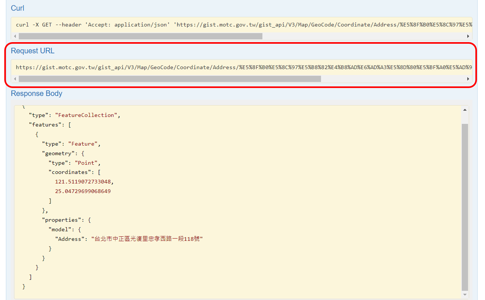

<style type="text/css">

body{
font-size: 18px;
font-family:"Times New Roman","標楷體",Georgia,Serif;
}
td {  /* Table  */
  font-size: 8px;
  font-family:"Times New Roman","標楷體",Georgia,Serif;
}
h1.title {
  font-size: 38px;
  color: DarkRed;
  font-family:"Times New Roman","標楷體",Georgia,Serif;
}
h1 { /* Header 1 */
  font-size: 28px;
      font-family:"Times New Roman","標楷體",Georgia,Serif;
  color: DarkBlue;
}
h2 { /* Header 2 */
    font-size: 22px;
    font-family:"Times New Roman","標楷體",Georgia,Serif;
    color: DarkBlue;
}
h3 { /* Header 3 */
  font-size: 18px;
  font-family:"Times New Roman","標楷體",Georgia,Serif;
  color: DarkBlue;
}
code.r{ /* Code block */
    font-size: 12px;
}
pre { /* Code block - determines code spacing between lines */
    font-size: 14px;
}
.blogbody{
font-size:17px;
  font-family:"Times New Roman","標楷體",Georgia,Serif;
line-height: 150%;
}
</style>


```{r setup, include=FALSE}
knitr::opts_chunk$set(echo = TRUE)
library(TDX)
library(dplyr)
library(sf)
library(ggplot2)
library(knitr)
library(kableExtra)
library(DT)
```


# **地理編碼**
地理編碼（Geocode）是指將地址或地標名稱轉換為經緯度的過程，最常見的軟體即是[Google地圖](https://www.google.com.tw/maps/)，輸入地址後，在打點座標處點選右鍵，即可複製該位置的經緯度，如下圖所示。

```{r Google_map, echo=FALSE, out.width="60%", fig.align="center"}

```

地理編碼看似簡單的查詢操作，然而若是要進行大量的地理編碼就不是容易的事情，大部分的軟體都需要收費或是有回傳結果的限制，故使用上須格外注意批次處理的數據量。本網頁將以臺灣為例，簡介三種地理編碼的實務操作方式，含括[內政部全國門牌地址定位服務](#TGOS)、[Google地圖地理編碼](#GoogleMap)、[交通部交通網路地理資訊倉儲系統定位服務](#GIST)。


<span id="TGOS"></span>

# **全國門牌地址定位服務**
全國門牌地址定位服務是內政部[地理資訊圖資雲服務平臺（TGOS）](https://www.tgos.tw/TGOS/Web/TGOS_Home.aspx)的其中一個功能，若欲使用此一平臺，請先註冊會員，會員註冊方法詳如下圖。請先進入TGOS網頁點選右上角的註冊，填寫完會員資料後再回到首頁並點選「全國門牌地址定位服務」，申請批次地址比對服務。將該服務加入購物車後，點選網頁右邊「購物車內容」中的「服務申請清單」，並點選「進行申請」。最後填妥申請資料與用途後，等待該平臺審核通知即可取得認證金鑰（API KEY）。

```{r TGOS_member, echo=FALSE, out.width="100%", fig.align="center"}

```

取得認證金鑰後，在網頁右上角處點選會員姓名，並點選最下面的「服務申請紀錄」，進入申請單後點選「取得服務網址」，並請複製APIKey。

```{r TGOS_API, echo=FALSE, out.width="80%", fig.align="center"}

```

最後再請回到門牌服務「批次門牌地址比對服務」，將剛複製好的APIKey貼到「基本參數設定」的欄位中，除此之外請設定[座標系統](https://chiajung-yeh.github.io/Spatial-Analysis/basic-knowledge-on-gis.html#coordinate-reference-system-crs)。若地址資料中僅含括臺灣本島的地址，建議選擇EPSG:3826之座標系統，但若資料中同時包含臺灣本島與離島地區，則建議使用EPSG:4326。接著依照網頁上所提供的「門牌檔範本」將地址資料輸入csv檔案後上傳至該平臺。「比對參數設定」中的「比對方式」通常採取「允許模糊比對」，表示找不到輸入的地址時，會尋找相似的地址以回傳座標結果。「多筆回傳限制」若選取不限制，表示當比對結果為多筆時，回傳所有資料；抑或可自行設定回傳筆數。

```{r TGOS_address, echo=FALSE, out.width="80%", fig.align="center"}

```

透過上述申請，請等待數個小時後，批次地址比對結果將會傳送至信箱，即可進行後續分析。惟須注意的是，本平臺一個會員每日僅供1萬筆的批次比對，故若資料量甚巨時，此方法可能難以處理。


<span id="GoogleMap"></span>

# **Google地圖地理編碼**
若欲使用Google地圖API，請先於Google地圖平台申請。此一服務所回傳的結果與自行手動在Google地圖查詢的地址、經緯度必一致，且該地圖平臺的地理編碼功能為目前全世界普遍使用的工具，實務上亦常以該工具開發應用程式。然而Google地圖平台申請過程中需要使用到信用卡，每個月將有$200美元可供免費使用，若超過此一金額，將會向使用者索費。Google地圖API的申請流程及操作方式詳如以下影片之介紹，官方文件請點[這裡](https://developers.google.com/maps/documentation/geocoding/overview?hl=zh-tw)。

<p align="center"><iframe src="https://www.youtube.com/embed/2_HZObVbe-g" data-external= "1" width=500 height=285> </iframe></p>
 
綜上所述，Google地圖API服務的地理編碼稍嫌複雜，且若資料量甚巨時，可能需要額外支付費用，可參酌使用之。


<span id="GIST"></span>

# **交通網路地理資訊倉儲系統定位服務**
[交通部地理資訊倉儲系統（GIS-T）](https://gist.motc.gov.tw/)收納路網、公共運輸等地理資料，除此之外亦提供地理編碼的介接服務。此服務為一種OpenAPI規範，用於將資料與以儲存並公開至網路，供使用者介接，降低應用程式開發的技術門檻。

交通部定位工具的OpenAPI網址在[這裡](https://gist.motc.gov.tw/gist_api/swagger/ui/index#!/Locator/Locator_03001)，請先點開網頁，將出現如下的畫面。

```{r MOTC_API, echo=FALSE, out.width="90%", fig.align="center"}

```

請在「Address」欄位中輸入欲查詢的地址，並點選「Try it Out!」，將出現如下結果。

```{r MOTC_API_result, echo=FALSE, out.width="90%", fig.align="center"}

```

接著將「Request URL」中的[網址](https://gist.motc.gov.tw/gist_api/V3/Map/GeoCode/Coordinate/Address/%E5%8F%B0%E5%8C%97%E5%B8%82%E4%B8%AD%E6%AD%A3%E5%8D%80%E5%BF%A0%E5%AD%9D%E8%A5%BF%E8%B7%AF%E4%B8%80%E6%AE%B5118%E8%99%9F?$format=GEOJSON)貼到瀏覽器上，網頁顯示畫面如下。  

```{r MOTC_API_result2, echo=FALSE, out.width="80%", fig.align="center"}

```

此一結果中，「coordinates」係顯示輸入地址的經緯度座標，如「`"coordinates":[121.5119072733048,25.04729699068649]`」即指經度為121.5119072733048°E；緯度為25.04729699068649°N。  

此網頁回傳結果為[GeoJSON](https://www.wikiwand.com/zh-tw/GeoJSON)檔案，可利用地理資訊系統相關軟體開啟。此外，後續撰寫程式時可逕讀取此一GeoJSON檔案，如是可提升分析的效率，或進行應用程式開發。  


## **R語言TDX套件 GIS-T地理編碼應用**
為了方便使用交通網路地理資訊倉儲系統定位服務，在R語言中開發一套件，供使用者直接將地址資料輸入於函式中，便可輸出地理編碼結果。請依照以下程式碼安裝套件。  

```{r TDX_package, echo=T, eval=F}
# 請先安裝devtools套件
install.packages("devtools")

# 接著再安裝TDX套件
devtools::install_github("ChiaJung-Yeh/NYCU_TDX")

# 完成安裝後，請呼叫TDX函式庫
library(TDX)
```

完成安裝與呼叫函式庫後即可開始使用此套件，其中有一函式`Geocoding()`可提供地理編碼服務。函式中的第一個參數必須放置地址資料的向量，程式碼撰寫如下。  

```{r TDX_example1, echo=T, eval=F}
# 將地址資料儲存於向量中
address=c("臺北市中正區忠孝西路一段118號", "新竹市東區大學路1001號", "新竹縣竹北市六家五路一段1號")

# 將地址向量address置入Geocoding()函式中
Geocoding(address)
```


```{r TDX_example1_out1, echo=F, eval=T, include=F}
address=c("臺北市中正區忠孝西路一段118號", "新竹市東區大學路1001號", "新竹縣竹北市六家五路一段1號")
address=Geocoding(address)
```

輸出結果如以下表格所示。

```{r TDX_example1_out2, echo=F, eval=T, message=F}
kbl(address, booktabs=T)%>%
  kable_styling(bootstrap_options=c("striped", "hover"), font_size=18)%>%
  column_spec(1, width="6cm", bold=T)%>%
  column_spec(2, width="7cm")
```


## **房價資料實務應用**
若地址儲存於資料中的其中一個欄位，則應利用「`$`」將資料中的地址欄位抽出，形成一組向量，再置於`Geocoding()`函式中。以下以房價資料為例，程式碼撰寫如下。

```{r TDX_example2, echo=T, eval=F, message=F}
house_price=read.csv("https://raw.githubusercontent.com/ChiaJung-Yeh/R-Code-Sharing/main/TDX/house_price.csv")
```

```{r TDX_example2_data, echo=F, eval=T, message=F}
house_price=read.csv("./house_price.csv")
datatable(house_price, options=list(pageLength=5, scrollX=T,
                                    headerCallback = DT::JS(
    "function(thead) {",
    "  $(thead).css('font-size', '0.5em');",
    "}"
  )))
```

上表為房價資料，其中包含房屋的所在鄉鎮市區、地址、基本房屋資料、房價等完整資訊，另外從中可發現，地址資料儲存於名為「ADDRESS」的欄位中，故應將`house_price$ADDRESS`放入`Geocoding()`函式內，即能回傳地理編碼結果，程式碼撰寫如下。  

```{r TDX_example2_geocode, echo=T, eval=F, message=F}
# 地理編碼
address_geocode=Geocoding(house_price$ADDRESS)

# 查看地理編碼結果
address_geocode
```

```{r TDX_example2_geocode_result, echo=F, eval=T, message=F}
address_geocode=read.csv("./address_geocode.csv")
datatable(address_geocode, options=list(pageLength=5, scrollX=T,
                                    headerCallback = DT::JS(
    "function(thead) {",
    "  $(thead).css('font-size', '0.5em');",
    "}"
  )))
```

以上表格為地理編碼的結果，其中`AddressOriginal`欄位表示的是原始輸入資料的地址；`AddressNew`欄位則為經過交通網路地理資訊倉儲系統定位服務所比對的地址；而`Geometry`為地理座標資料（經緯度）。  

執行完地理編碼後，最後須合併原始的房價資料與地理編碼的結果，可利用`dplyr`套件中的`left_join()`函式合併之。  

```{r TDX_example2_merge, echo=T, eval=F, message=F}
# 將地理編碼結果與原始房價資料合併
house_price_merge=left_join(house_price, address_geocode, by=c("ADDRESS"="AddressOriginal"))

# 查看回傳結果
house_price_merge
```

```{r TDX_example2_merge_result, echo=F, eval=T, message=F}
house_price_merge=left_join(house_price, address_geocode, by=c("ADDRESS"="AddressOriginal"))
datatable(house_price_merge, options=list(pageLength=5, scrollX=T,
                                    headerCallback = DT::JS(
    "function(thead) {",
    "  $(thead).css('font-size', '0.5em');",
    "}"
  )))
```

合併後的結果如上表，請拉到表格的最後兩欄位（`AddressNew`、`Geometry`），其為合併後貼附的資料，包含比對後的地址與經緯度資料。  


# **結語**
地理編碼為地理資料實務分析的基礎，在進行統計分析前必須先透過此一工具蒐集經緯度資料。地理編碼批次地址比對並非容易的事，有時可能所費不貲，抑或比對的資料筆數有所限制，使分析上大受阻礙。是故，建議應善用交通部所提供的定位服務，並可利用`TDX`套件中的`Geocoding()`函式完成之。關於`TDX`套件或地理編碼其他相關問題，請逕聯繫<a href="mailto:1328robert@gmail.com"><u>這裡</u></a>。  


