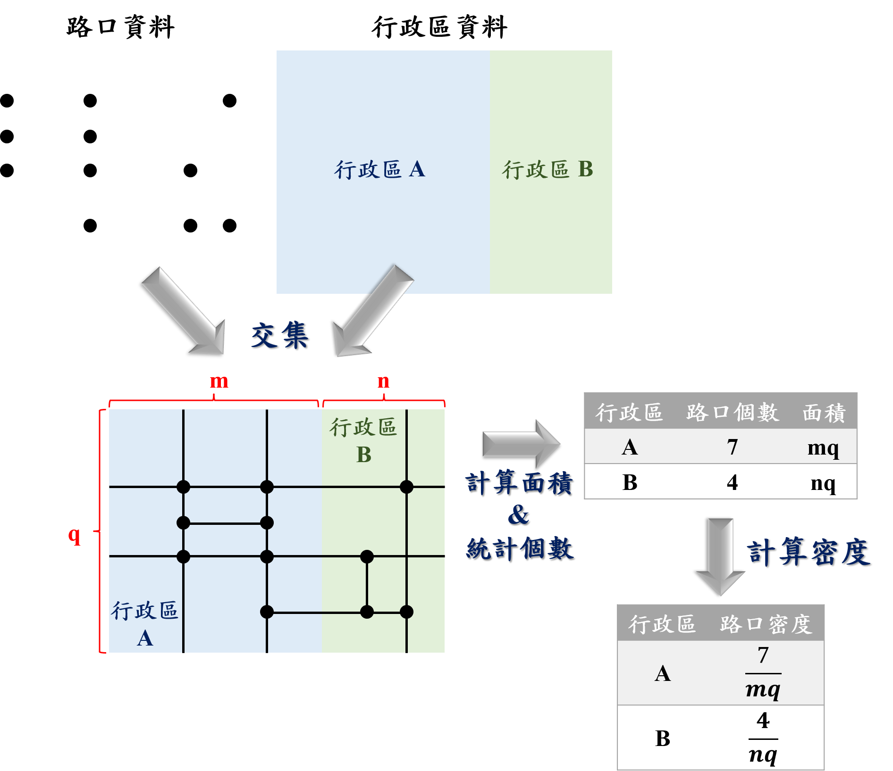

<style type="text/css">

body{
font-size: 18px;
font-family:"Times New Roman","標楷體",Georgia,Serif;
}
td {  /* Table  */
  font-size: 18px;
  font-family:"Times New Roman","標楷體",Georgia,Serif;
}
h1.title {
  font-size: 38px;
  color: DarkRed;
  font-family:"Times New Roman","標楷體",Georgia,Serif;
}
h1 { /* Header 1 */
  font-size: 28px;
      font-family:"Times New Roman","標楷體",Georgia,Serif;
  color: DarkBlue;
}
h2 { /* Header 2 */
    font-size: 22px;
    font-family:"Times New Roman","標楷體",Georgia,Serif;
    color: DarkBlue;
}
h3 { /* Header 3 */
  font-size: 18px;
  font-family:"Times New Roman","標楷體",Georgia,Serif;
  color: DarkBlue;
}
code.r{ /* Code block */
    font-size: 12px;
}
pre { /* Code block - determines code spacing between lines */
    font-size: 14px;
}
.blogbody{
font-size:17px;
  font-family:"Times New Roman","標楷體",Georgia,Serif;
line-height: 150%;
}
</style>


```{r setup, include=FALSE}
knitr::opts_chunk$set(echo = TRUE)
library(dplyr)
library(ggplot2)
library(jsonlite)
library(sf)
library(knitr)
library(kableExtra)
library(TWspdata)
```


# **分析流程與資料**
為計算交叉路口密度，須備齊路口經緯度座標資料，以及行政區（如：村里）圖資。將路口資料與行政區進行交集，可瞭解每一路口位於哪一個行政區，接著針對同一行政區統計其路口個數，以及該行政區的面積，並進一步將兩數值相除，即可得該行政區的交叉路口密度。  

分析流程依步驟彙整如下：  

1.  路口資料與行政區取交集  
2.  統計行政區的路口個數  
3.  計算各行政區面積與路口密度  

計算流程與範例詳如 Figure\@ref(fig:analysis-process) 所示。  

```{r analysis-process, echo=F, eval=T, out.width='70%', fig.align='center', fig.cap="分析流程示意圖"}

```

Figure \@ref(fig:analysis-process) 中，首先將路口資料與行政資料取交集，分為行政區 A 與行政區 B。接著計算兩塊面積，分別為 $mq$ 與 $nq$。此外亦可統計每一個行政區內擁有的路口數，分別為 7 個與 4 個，故依據上述，密度係將兩者相除，所得結果分別為 $7/mq$ 與 $4/nq$。  

依據此一分析流程，後續章節先行介紹地理資訊系統的基礎觀念，並進行實作。  

本分析過程所需資料彙整於 Table \@ref(tab:analysis-data) 所示。  

```{r analysis-data, echo=F, eval=T}
data_need=data.frame(data=c("路口資料", "村里資料"), sour=c("[交通部道路路口定位服務](https://link.motc.gov.tw/swagger/ui/index#!/Node/Node_GetInterCityCNodeID)<br>請點[此處](https://github.com/ChiaJung-Yeh/R-Code-Sharing/raw/main/road_intersections/intersection_data.zip)直接下載所有資料，並解壓縮", '請安裝`TWspdata`套件<br>`install.packages("devtools")`<br>`devtools::install_github("ChiaJung-Yeh/TWspdata")`<br>`library(TWspdata)`<br>載入套件後，請使用`taiwan_village`資料'))
colnames(data_need)=c("資料","來源")
kbl(data_need, booktabs=T, escape=F, caption="資料來源與下載")%>%
  kable_styling(bootstrap_options=c("striped", "hover"), font_size=18)
```


# **地理資訊系統簡介**

## WKT
WKT 是為純文本標記格式（Well-known text,WKT），用以表達向量資料的空間位置，而在二維空間中可表示的幾何圖形含括：點（Point）、線（LineString）、面（Polygon）、多點（MultiPoint）、多線（MultiLineString）、多面（MultiPolygon）、幾何集合（GeometryCollection）。在本分析中，我們所使用的路口資料即為「點資料」；村里即為「面資料」。  

WKT 的記錄方法如 Table \@ref(tab:wkt-type) 所示。  

```{r wkt-type, echo=F, eval=T}
wkt_type=data.frame(Type=c("**Point**","**LineString**","**Polygon**"), Graph="", WKT=c("POINT (3 3)","	LINESTRING (1 4, 3 3, 5 5)","POLYGON ((1 4, 2 2, 4 1, 5 5, 1 4))"))
colnames(wkt_type)=c("點線面","圖例","WKT")
kbl(wkt_type, booktabs=T, escape=F, caption="WKT 撰寫方式")%>%
  kable_styling(bootstrap_options=c("striped", "hover"), font_size=18)%>%
  column_spec(2, image=spec_image(c("./figure/point.png", "./figure/line.png","./figure/polygon.png"), 500, 500))
```

本分析所提供的資料中，路口資料即是以 WKT 純文本標記格式儲存。  


## Shapefile
Shapefile 格式可用以描述（多）點線面，然與 WKT 格式最大不同點在於 Shapefile 無法儲存幾何集合（GeometryCollection），而其應用多以二維平面的空間描述為主。須注意的是，Shapefile 是一種格式名稱，並非檔案名稱，該格式主要由四個檔案所組成，即「.shp」、「.shx」、「.dbf」、「.prj」四者。

Shapefile 的檔案彙整如 Table \@ref(tab:shape-file) 所示。  

```{r shape-file, echo=F, eval=T}
shape_file=data.frame(File=c(".shp",".shx",".prj",".dbf"), type=c("圖形格式","圖形索引格式","屬性資料格式","投影格式"),feature=c("記錄點線面的實際座標","建構幾何元素索引","記錄幾何元素的屬性資料","儲存地理座標系統的投影資訊"))

colnames(shape_file)=c("檔案","格式類型","功能")

kbl(shape_file, booktabs=T, caption="Shapefile 檔案類型", escape=F)%>%
  kable_styling(bootstrap_options=c("striped", "hover"), font_size=14)%>%
  column_spec(1, bold=T)
```


## 座標參考系統 (CRS)
座標參考系統主要可分為兩大類型：地理座標系統（Geographic Coordinate System, GCS）與投影座標系統（Projected Coordinate System，PCS）。地理座標系統是直接將「經度」定義為「X」、「緯度」定義為「Y」，並且以赤道及本初子午線之交點作為原點，該系統可完整定義全球的座標，但並難以進一步藉此計算面積與距離。投影座標系統為此改善了使用經緯度來定義座標位置的缺失，利用數學方法將地球投影至平面地圖，再依據投影的結果給定原點與座標軸，這麼一來即可定義投影結果上所有點的座標值。  

Table \@ref(tab:crs) 以簡單範例說明地理座標系統（GCS）與投影座標系統（PCS）的差異。  

```{r crs, echo=F, eval=T}
crs=data.frame(File=c("地理座標系統（GCS）","投影座標系統（PCS）"), feature=c("經緯度座標","利用投影所得的平面座標"), units=c("角度","公尺"), WKID=c("EPSG:4326","EPSG:3826"), exam=c("(121.51754, 25.04624)","(302221.38, 2770999.06)"))

colnames(crs)=c("座標類型","特徵","單位","臺灣常用EPSG代碼","實例（臺北車站）")

kbl(crs, booktabs=T, caption="地理與投影座標系統比較", escape=F)%>%
  kable_styling(bootstrap_options=c("striped", "hover"), font_size=18)%>%
  column_spec(1, bold=T)
```


## R 語言相對應套件
下載`sf`套件，用以處理地理資料，並進行地理資料處理。  
下載`dplyr`套件，用以處理、統計數據。  
下載`ggplot2`套件，用以繪製地圖。  

```{r required-packages, echo=T, eval=F}
install.packages("sf")
install.packages("dplyr")
install.packages("ggplot2")
library(sf)
library(dplyr)
library(ggplot2)
```


# **分析操作**
本範例以臺北市為例，分析臺北市各個村里的路口密度。  

## 村里資料與路口資料取交集
首先讀取本分析中所需的檔案。  

```{r read-data-show, echo=T, eval=T}
# 從解壓縮後的資料夾中讀取臺北市_IntersectionGeometry.csv
road_inter=read.csv("./intersection_data/臺北市_IntersectionGeometry.csv")

# 查看road_inter前六筆資料
head(road_inter)

# 從TWspdata套件中使用村里資料
library(TWspdata)

# 查看taiwan_village前六筆資料
head(taiwan_village)
```

接著必須進一步處理我們所蒐集的數據：將全臺的村里資料中擷取臺北市者，並將路口資料中的 WKT 欄位轉換為空間資料。惟須注意的是，由於在交通部所提供的路口資料集中含有許多重複的資料，如「道路 A 與道路 B 交會的路口」以及「道路 B 與道路 A 交會的路口」兩者實屬表達同一個路口，在資料庫中會重複記錄，故必須先行篩除之。  

:::notice
<font size="5">**NOTE**</font>  
<ul>
  <li>程式碼中利用`st_as_sfc()`函式將 WKT 文字資料轉換為空間資料，相關操作詳見[Spatial Analysis with R (Chia Jung, Yeh) 4.4小節](https://chiajung-yeh.github.io/Spatial-Analysis/geographic-data.html#convert-text-file-to-shapefile)</li>
  <li>程式碼中利用`st_sf()`函式將純`data.frame`格式新增`sf`格式，可變為完整的地理資料，相關操作詳見[Spatial Analysis with R (Chia Jung, Yeh) 4.3小節](https://chiajung-yeh.github.io/Spatial-Analysis/geographic-data.html#simple-feature-sf)</li>
</ul>
:::

```{r filter-data-show, echo=T, eval=T}
# 篩選臺北市的村里資料
taipei=filter(taiwan_village, COUNTYNAME=="臺北市")

# 查看taipei前六筆資料
head(taipei)

# 篩選出重複的欄位
repeat_row=which(duplicated(road_inter$Geometry))

# 不重複的欄位
nonrepeat_row=setdiff(c(1:nrow(road_inter)), repeat_row)

# 整理路口資料（篩除重複者）
road_inter=road_inter[nonrepeat_row,]

# 將路口資料的WKT轉換為空間資料
road_inter=mutate(road_inter, Geometry=st_as_sfc(Geometry))%>%
  st_sf(crs=4326)

# 查看road_inter前六筆資料
head(road_inter)
```

先簡單繪圖來觀察兩資料的空間分布，出圖結果如 Figure \@ref(fig:plot-map-show) 所示。  

:::notice
<font size="5">**NOTE**</font>  
<ul>
  <li>程式碼中利用`geom_sf()`函式在`ggplot2`套件中繪製地圖，相關操作詳見[Spatial Analysis with R (Chia Jung, Yeh) 3.1小節](https://chiajung-yeh.github.io/Spatial-Analysis/data-visualization-with-maps.html#making-maps)</li>
</ul>
:::

```{r plot-map-show, echo=T, eval=T, out.width='100%', fig.align='center', fig.cap="村里與路口資料疊圖結果"}
# 將村里地圖與路口資料疊圖
ggplot()+
  geom_sf(data=taipei)+
  geom_sf(data=road_inter, size=0.01)
```


接著將路口資料與村里資料利用`st_intersection()`函式取交集，以回傳每一個路口所在的行政區，如此一來尚能在後續分析每一村里中的路口個數。在此務必注意，進行地理資料處理時建議統一所有地理資料的座標參考系統，否則會出現錯誤訊息，抑或出現錯誤的分析結果。  

:::notice
<font size="5">**NOTE**</font>  
<ul>
  <li>程式碼中利用`st_transform()`函式轉換座標參考系統，相關操作詳見[Spatial Analysis with R (Chia Jung, Yeh) 4.5小節](https://chiajung-yeh.github.io/Spatial-Analysis/geographic-data.html#reproject-geographic-data)</li>
  <li>程式碼中利用`st_intersection()`函式將兩地理資料取交集，相關操作詳見[Spatial Analysis with R (Chia Jung, Yeh) 5.9小節](https://chiajung-yeh.github.io/Spatial-Analysis/spatial-operations.html#clipping)</li>
</ul>
:::

```{r transform, echo=T, eval=T, out.width='100%', fig.align='center', fig.cap="村里與路口資料疊圖結果"}
# 先將CRS轉換為統一格式，尚能進行交集
# 建議皆轉換為EPSG:3826
taipei=st_transform(taipei, crs=3826)
road_inter=st_transform(road_inter, crs=3826)

# 將村里地圖與路口資料取交集
road_inter=st_intersection(road_inter, taipei[, c("VILLCODE", "COUNTYNAME", "VILLNAME")])

# 查看road_inter交集後結果
head(road_inter)
```


透過上述回傳結果可以發現，路口資料中含括路口名稱、路口所在村里。  

## 統計村里的路口個數

接下來即可進一步針對「VILLCODE」（村里代碼）計算屬於同一村里的資料列數，亦即每個村里的路口個數。惟須注意的是，在進行統計時，請務必先行去除原地理資料中的空間欄位，以避免在聚合時，一同將空間進行聚合，而浪費諸多計算時間。  

:::notice
<font size="5">**NOTE**</font>  
<ul>
  <li>程式碼中利用`st_drop_geometry()`函式將空間欄位予以去除，相關操作詳見[Spatial Analysis with R (Chia Jung, Yeh) 4.8小節](https://chiajung-yeh.github.io/Spatial-Analysis/geographic-data.html#join-attribute-and-spatial-data)</li>
  <li>程式碼中利用`group_by() %>% summarise()`函式係將一資料針對特定的欄位分群，接著再針對每一分群中進行運算，相關操作詳見[Spatial Analysis with R (Chia Jung, Yeh) 5.2小節](https://chiajung-yeh.github.io/Spatial-Analysis/spatial-operations.html#attribute-aggregation)</li>
</ul>
:::

```{r grouup_by_count, echo=T, eval=T, out.width='100%', fig.align='center', fig.cap="村里與路口資料疊圖結果"}
# 將路口資料的空間欄位剔除
road_inter_df=st_drop_geometry(road_inter)

# 依據村里名稱與代碼統計其路口個數
road_count=group_by(road_inter_df, TOWNNAME, VILLNAME, VILLCODE)%>%
  summarise(inter_count=n())
```


## 計算各村里面積與路口密度
目前為止大抵上已完成較複雜的分析，接下來只要針對現有資料中的欄位進行基礎運算即可。在計算路口密度時，除了需要各個村里的路口個數外，尚須計算每一個村里的面積，並且將兩者予以相除，所得結果即為路口密度。在本程式碼中計算完面積後，先將其轉換為平方公里的單位，並且轉換為數值型態。  

:::notice
<font size="5">**NOTE**</font>  
<ul>
  <li>程式碼中利用`left_join()`函式將路口個數計算結果的屬性值，與臺北市村里地理資料予以合併，相關操作詳見[Spatial Analysis with R (Chia Jung, Yeh) 4.8小節](https://chiajung-yeh.github.io/Spatial-Analysis/geographic-data.html#join-attribute-and-spatial-data)</li>
  <li>程式碼中利用`st_area()`函式計算村里的面積，請注意原單位為平方公里，且資料型態屬於`units`，建議先行轉換為平方公尺，並利用`as.numeric()`函式調整為數值型態之格式，相關操作詳見[Spatial Analysis with R (Chia Jung, Yeh) 5.12小節](https://chiajung-yeh.github.io/Spatst_areaal-Analysis/spatial-operations.html#geometric-measurement)</li>
</ul>
:::

```{r calculate_density, echo=T, eval=T, out.width='100%', fig.align='center', fig.cap="村里與路口資料疊圖結果"}
# 合併路口個數屬性資料與村里地理資料
taipei=left_join(taipei, road_count)

# 計算臺北市各村里的面積
taipei$AREA=as.numeric(st_area(taipei))/1000000

# 計算路口密度
taipei$DENSITY=taipei$inter_count/taipei$AREA

# 查看taipei前六筆資料
head(taipei[ ,c("COUNTYNAME","TOWNNAME","VILLNAME","inter_count","DENSITY")])
```


由以上結果中以第一列為例，其表示文山區樟新里共計 33 個路口，密度為每平方公里 169.1 個路口。而為了更具視覺化呈現路口密度結果，可繪製地圖如 Figure \@ref(fig:plot-density-show) 所示。  

:::notice
<font size="5">**NOTE**</font>  
<ul>
  <li>程式碼中利用`geom_sf()`函式在`ggplot2`套件中繪製分層設色地圖，相關操作詳見[Spatial Analysis with R (Chia Jung, Yeh) 3.4小節](https://chiajung-yeh.github.io/Spatial-Analysis/data-visualization-with-maps.html#graduated-symbol-map)</li>
</ul>
:::

```{r plot-density-show, echo=T, eval=T, out.width='100%', fig.align='center', fig.cap="臺北市各村里路口密度"}
# 繪製地圖
ggplot()+
  geom_sf(data=taipei, aes(fill=DENSITY), size=0.01)+
  scale_fill_distiller(palette="YlOrRd", direction=1)+
  theme_void()
```


